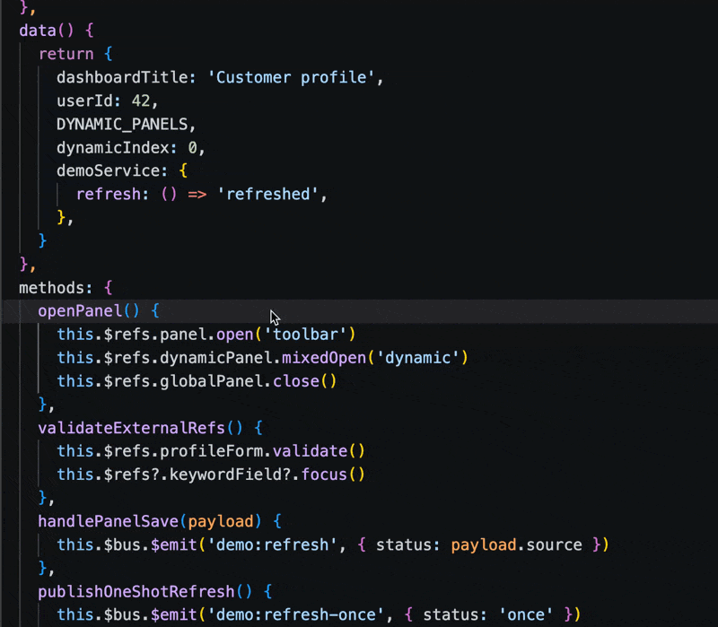
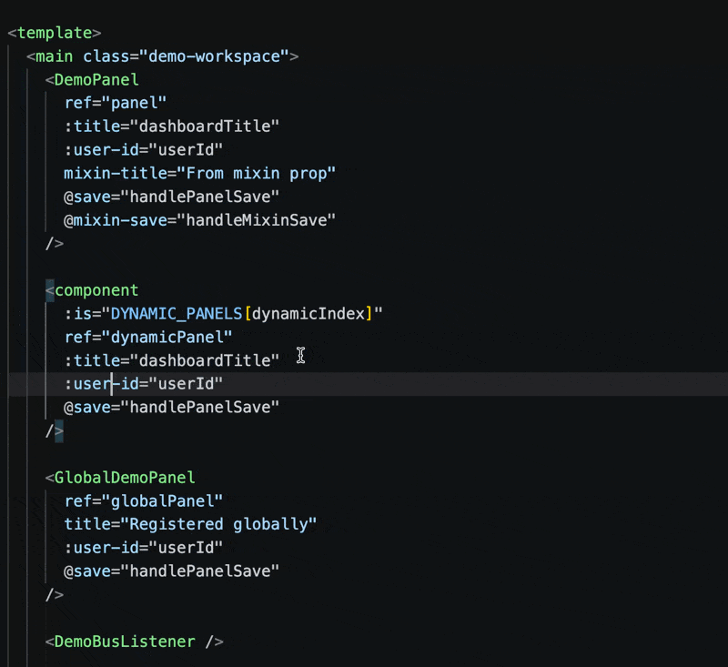
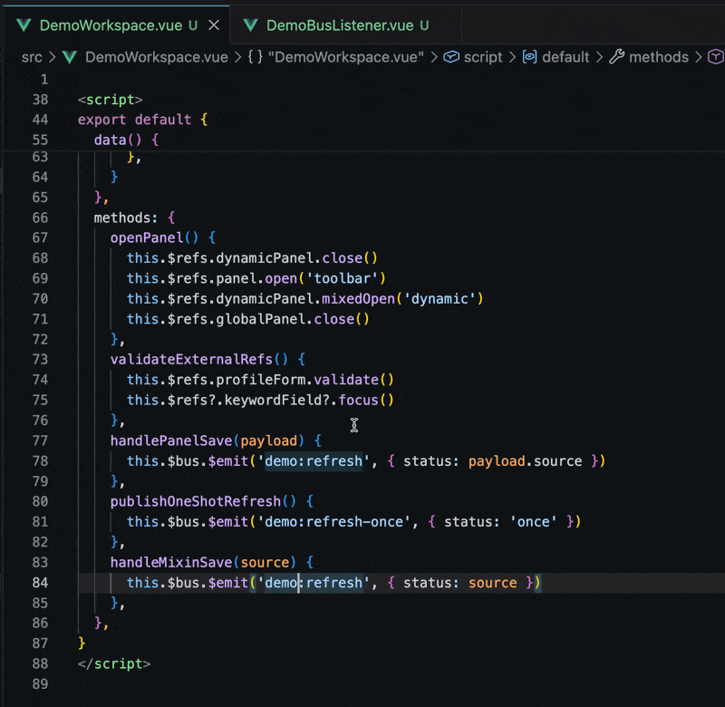
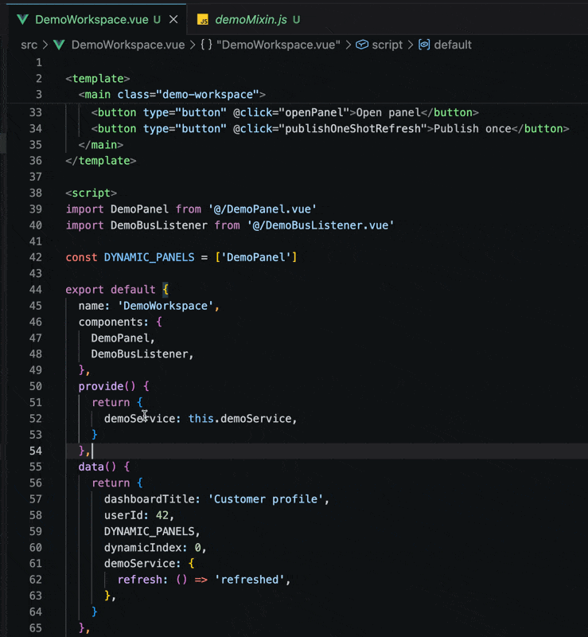

# vue-component-navigator

给 Vue 2 Options API 项目用的 VS Code 导航辅助插件。

> English documentation: [README.md](./README.md)

这个插件主要处理老 Vue 2 项目里容易断开的关系：`$refs`、组件 props/events、`provide` / `inject`、mixins、全局组件，以及常见的 Event Bus。

它不会替代 Vue 官方工具。比如局部组件标签名的定义跳转会交给官方扩展处理，避免同一个位置出现重复结果。

## 功能演示

### `$refs` 跳转

展示从 `this.$refs.child.open()` 跳到子组件方法，并展示方法补全和 hover。

##### 


### Props 和 Events

展示模板 prop 到子组件 prop 定义、模板事件到 `this.$emit(...)`、hover 概览和反向引用。

##### 

### Event Bus

展示 `$emit`、`$on`、`$once`、`$off` 的跳转、事件名补全、方法补全，以及 hover 中的方法标记。

##### 


### `provide` / `inject`

展示静态 `inject` key 跳到最近的静态 provider，以及 provider 反查 consumer。

##### 


## 支持的场景

- `$refs` 方法跳转、补全、hover 和引用查询。
- 模板 prop 跳到子组件 prop 定义。
- 模板事件和子组件 `this.$emit(...)` 互相跳转。
- Vue 2 Event Bus 静态字符串事件名导航。
- 静态 `provide` / `inject` key 跳转和补全。
- 静态局部组件 import、异步组件 import、简单别名。
- workspace 内 `.js`、`.ts`、`.vue` 文件中的静态 mixin。
- `Vue.component(...)` 这类静态全局组件注册。
- 已支持第三方库的 `$refs` 方法类型，例如 Element UI 的 `el-form.validate()` 和 Vant 的 `van-field.focus()`。
- 从最近的 `jsconfig.json` 或 `tsconfig.json` 读取 `@/` 这类路径别名。

## Event Bus 入口

Event Bus 名称需要能从 Vue prototype 注册中识别，例如：

```js
Vue.prototype.$bus = new Vue()
Vue.prototype.$eventBus = new Vue()
```

默认会检查这些入口：

- `src/main.js`
- `src/index.js`
- `src/main.ts`
- `src/index.ts`

如果项目入口不在这些文件里，可以显式配置：

```json
{
  "vueComponentNavigator.entry": "src/bootstrap.js"
}
```

也可以配置多个入口：

```json
{
  "vueComponentNavigator.entry": ["src/bootstrap.js", "@/entry"]
}
```

入口路径支持 workspace 相对路径，也支持 `jsconfig.json` / `tsconfig.json` 中 `compilerOptions.baseUrl` 和 `compilerOptions.paths` 定义的别名。

扫描范围只包括入口文件本身，以及入口直接字面量 `import`、`import()`、`require()` 的一层文件。不会继续递归扫整个项目。

只有在这些入口文件中识别到的 bus 名称才会参与 Event Bus 分析。`$bus` 不再有内置兜底。

## 命令

| 命令 | 说明 |
| --- | --- |
| `Vue Component Navigator: Show Status` | 查看索引状态，以及当前文件是否已被索引。 |
| `Vue Component Navigator: Reindex Workspace` | 手动重建 workspace 索引。大型重构或配置变更后可以使用。 |

## 配置

| 配置 | 说明 |
| --- | --- |
| `vueComponentNavigator.entry` | Event Bus 注册入口文件。支持字符串或字符串数组。 |

## 边界

- 只面向 Vue 2 Options API。
- 不处理 Vue 3 和 `<script setup>`。
- 不处理动态名称和拼接路径，比如 `import('./' + type + '.vue')`。
- 不处理动态 refs、prop 名、event 名、Event Bus 名称、`provide` / `inject` key。
- 不处理全局 mixin、spread mixin、条件 mixin 和 package mixin。
- `node_modules` 中组件的模板 prop/event 关系仍会忽略。`$refs` 方法只按需读取已支持库里能直接映射到的类型文件，例如 Element UI 和 Vant 的声明文件。
- 忽略 workspace 外部文件。

解析策略会尽量保守。静态证明不了的关系，不返回猜测结果。
