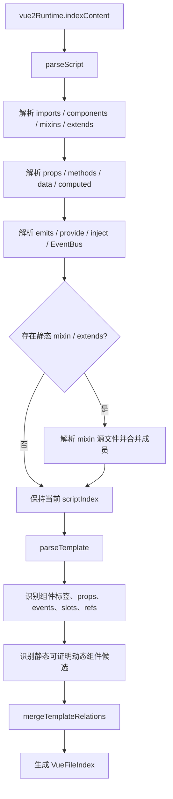
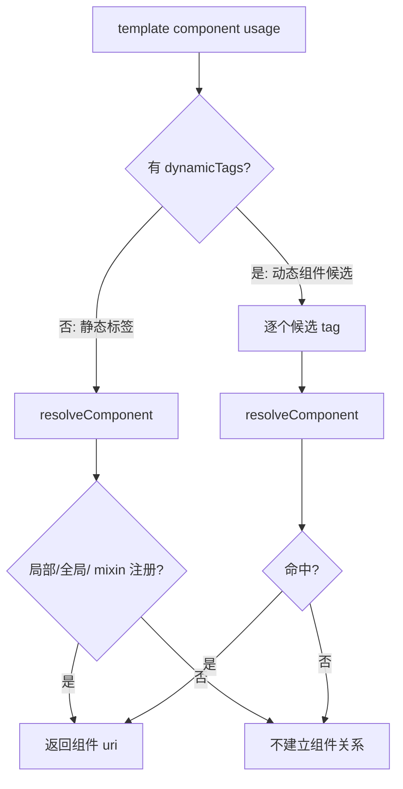
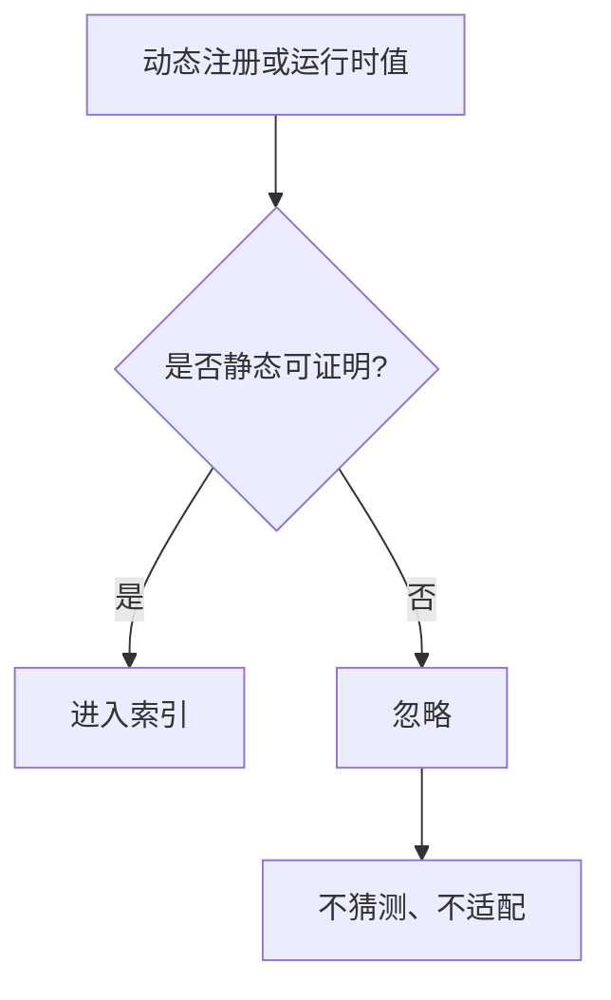
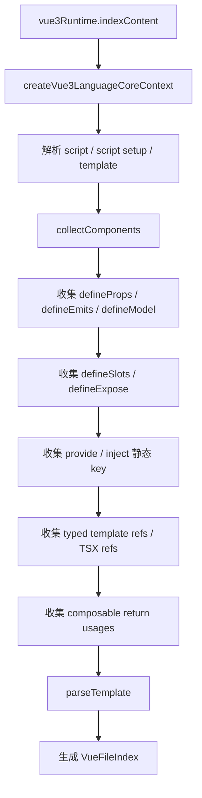
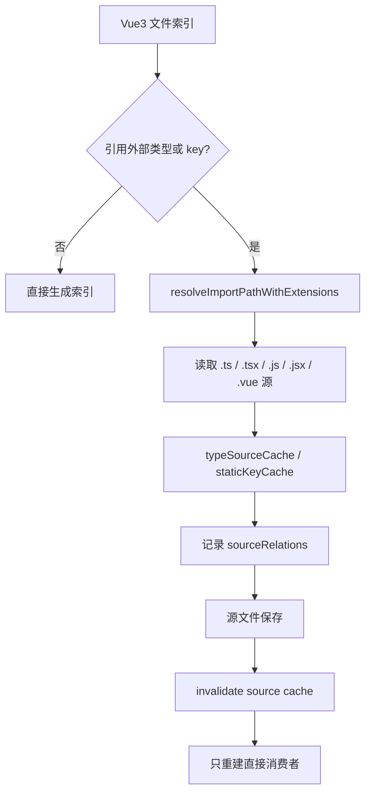
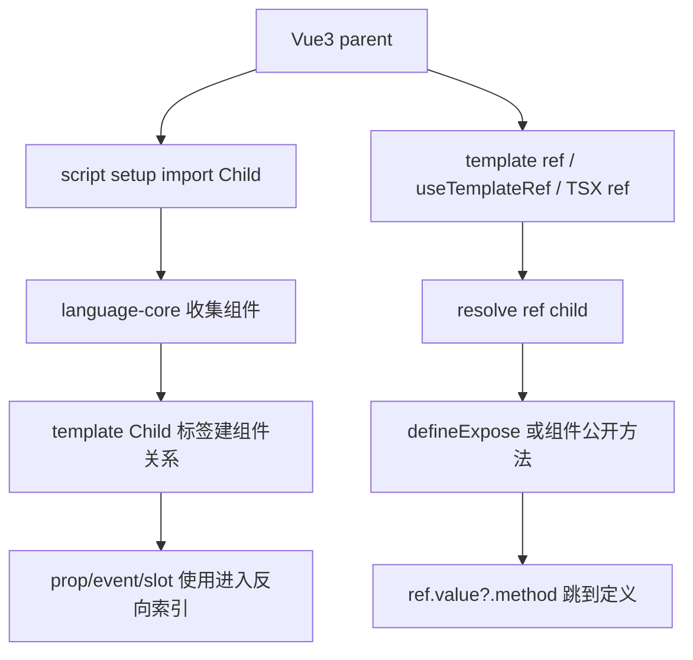
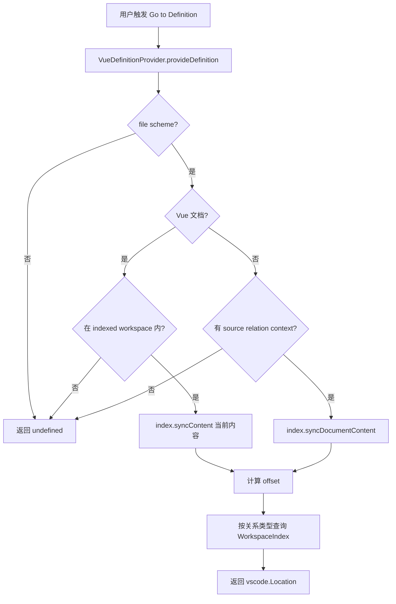
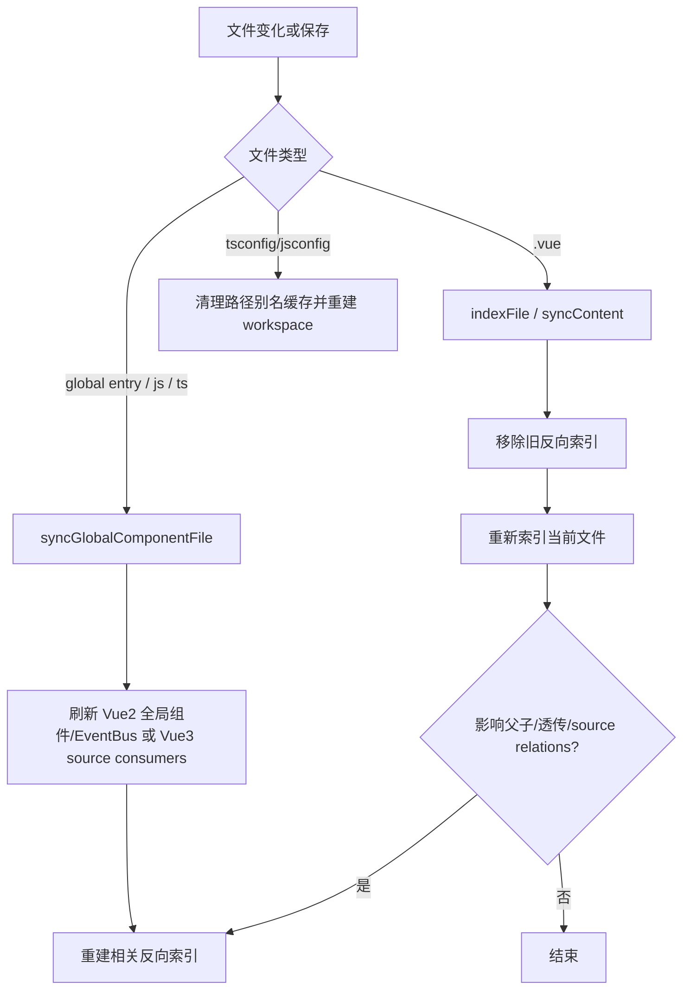

# Vue Component Navigator 运行流程

本文从扩展实际运行链路说明 Vue2 / Vue3 如何分流，以及 provider 如何基于索引结果提供跳转、悬浮、引用、补全和 CodeLens。

## 总览

扩展不会执行用户项目的 Vue 代码。它在 VS Code 扩展进程中读取源码，构建静态索引，然后各个 provider 查询这些索引。

```mermaid
flowchart TD
  A[VS Code 激活扩展] --> B[activate 创建 WorkspaceIndex]
  B --> C[扫描 workspace package.json]
  C --> D{找到 Vue 项目 root?}
  D -- 否 --> E[不注册/不刷新索引]
  D -- 是 --> F[识别 Vue 主版本]
  F --> G[indexWorkspace(root, version)]
  G --> H{version}
  H -- Vue2 --> I[Vue2 runtime]
  H -- Vue3 --> J[Vue3 language-core runtime]
  I --> K[生成 VueFileIndex]
  J --> K
  K --> L[WorkspaceIndex 建反向索引]
  L --> M[Definition / Hover / Reference / Completion / CodeLens 查询]
```

## 启动与建索引

入口在 `src/extension.ts`。

1. `activate()` 创建一个共享的 `WorkspaceIndex`。
2. 扫描 workspace 下的 `package.json`，最多跳过 `node_modules`、`.git`、`dist` 等目录。
3. 从依赖中判断 Vue 主版本。
4. 对每个 Vue project root 调用 `index.indexWorkspace(root, token, entryConfig, version)`。
5. 索引完成后用 `index.replaceWith(nextIndex)` 原子替换当前索引。

```mermaid
flowchart TD
  A[activate] --> B[new WorkspaceIndex]
  B --> C[indexWorkspaceFolders]
  C --> D[workspaceVuePackages]
  D --> E{每个 package root}
  E --> F[读取 entry 配置]
  F --> G[nextIndex.indexWorkspace(root, version)]
  G --> H{取消?}
  H -- 是 --> I[状态: cancelled]
  H -- 否 --> J[index.replaceWith(nextIndex)]
  J --> K[状态: ready]
```

## WorkspaceIndex 分流

`WorkspaceIndex` 是统一入口，但内部保存了两个 runtime：

- Vue2：`vue2Runtime`
- Vue3：`Vue3LanguageCoreRuntime`

每个 root 的版本记录在 `workspaceVueVersions` 中。单个文件索引时，会先根据文件 URI 找到所属 root，再选择 runtime。

```mermaid
flowchart TD
  A[indexContent(uri, content)] --> B[parseSfc / parseIndexableContent]
  B --> C[vueVersionForUri(uri)]
  C --> D{Vue 主版本}
  D -- 2 --> E[vue2Runtime.indexContent]
  D -- 3 --> F[vue3Runtime.indexContent]
  E --> G[files.set(uri, file)]
  F --> G
  G --> H[addSourceRelations]
  H --> I[addRelationshipUsages]
  I --> J[addEventBusUsages / addInjectUsages]
  J --> K{关系影响父子/透传?}
  K -- 是 --> L[rebuildReverseIndexes]
  K -- 否 --> M[结束]
```

## Vue2 运行链路

Vue2 使用 Options API 静态解析。它重点处理 `components`、`mixins`、`extends`、`props`、`methods`、`data`、`computed`、`provide/inject`、EventBus 和 `$refs`。



### Vue2 组件解析规则

Vue2 普通静态组件只接受可证明来源：

- `components: { Child }`
- 静态全局注册 `Vue.component('Child', Child)`
- mixin / extends 中静态注册的 `components`

动态组件只有在 `templateParser` 能产出 `dynamicTags` 时参与解析。`dynamicTags` 的候选必须来自局部注册、全局静态注册或 mixin / extends 注册，不会仅凭 import 进入组件关系。



这意味着普通静态标签不会仅凭 import 建关系：

```vue
<template>
  <BusinessChannelDialog />
</template>

<script>
import BusinessChannelDialog from './BusinessChannelDialog.vue'

export default {}
</script>
```

上面没有 `components: { BusinessChannelDialog }`，所以不会解析为真实组件关系。

### Vue2 mixin 运行方式

```mermaid
flowchart TD
  A[父组件 parseScript] --> B[parseMixins]
  B --> C{mixin 是静态 import?}
  C -- 否 --> D[忽略动态 mixin]
  C -- 是 --> E[resolveImportPathWithExtensions]
  E --> F[读取 mixin 源文件]
  F --> G[parseScript(mixin)]
  G --> H[缓存 Vue2Runtime mixin index]
  H --> I[合并 components / props / methods / data / computed]
  I --> J[template 实例成员可跳到当前组件或 mixin sourceLocation]
```

template 中的 `screenBannerList`、`buttonFormatArr` 这类成员，会从合并后的 `optionMembers` 查定义位置。hover 只展示 JSDoc 注释和定义位置，不展示完整实现。

### Vue2 不处理的动态场景



典型不处理：

- `require.context(...)` 动态全局注册。
- 运行时拼接组件名。
- 从接口、store、复杂函数返回得到的组件名。
- 普通静态标签只 import 但未注册。

## Vue3 运行链路

Vue3 使用 `@vue/language-core` 做 SFC 和宏感知索引。它重点处理 `<script setup>`、宏、类型源、typed refs 和 composable。



### Vue3 类型源和缓存

Vue3 会读取导入的类型源和 key 源，并缓存结果。文件保存时，只重建直接消费者。



### Vue3 组件和 ref 关系



Vue3 不使用 Vue2 的全局组件、mixin、EventBus 逻辑作为目标能力。

## Provider 查询链路

以 definition 为例，运行时不会重新全量扫描 workspace，只会同步当前打开文件，然后查询已有索引。



definition 的查询顺序大致是：

1. Vue3 prop type / prop usage。
2. `$refs` / template ref 方法调用。
3. EventBus。
4. template 组件标签 / prop / event / slot。
5. template 实例成员。
6. emit / method / prop 定义处的反向引用。
7. provide / inject。

Hover、Reference、Completion、CodeLens 使用同一份索引，只是返回的 VS Code 类型不同。

## Vue2 + Vue3 共存

同一个 VS Code workspace 可以包含多个 Vue project root。

```mermaid
flowchart TD
  A[VS Code workspace] --> B[package A: Vue2]
  A --> C[package B: Vue3]
  B --> D[indexWorkspace(rootA, 2)]
  C --> E[indexWorkspace(rootB, 3)]
  D --> F[Vue2 runtime 索引]
  E --> G[Vue3 language-core runtime 索引]
  F --> H[WorkspaceIndex.files]
  G --> H
  H --> I[反向索引按 uri / root / sourceLocation 区分]
  I --> J[provider 查询当前文件所属 root]
```

边界规则：

- workspace 外文件不会被 provider 同步进索引。
- root 为空时不会放开所有 Vue 文件。
- Vue2 专属能力只在 Vue2 root 生效。
- Vue3 专属能力只在 Vue3 root 生效。
- source 文件保存时，只按已记录的 source relations 重建消费者。

## 增量更新



这个设计的目标是：用户正在编辑时只同步当前文件，source 变化时只重建直接消费者，避免每次 provider 触发都做全量扫描。
